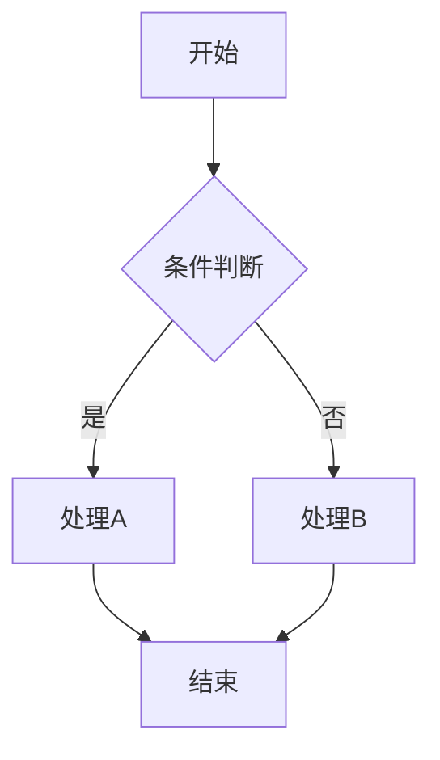

# Stream2Graph 数据集构建项目 (8000条数据目标)

## 项目概述

**项目名称**: 从倾听者到可视化者：降低同步话语认知负荷的主动式实时图表代理
**目标会议**: CSCW 2026
**核心创新**: 构建能主动监听会议对话并实时生成结构化图表的智能代理
**数据集规模**: **8,000条高质量样本** (更新于2026-02)

---

## 数据收集目标

### 图表类型分布 (总计8000条)

| 图表类型 | 目标数量 | 占比 | 对应言语行为 |
|---------|---------|------|-------------|
| 流程图 (Flowchart) | 1,920 | 24% | Sequential |
| 时序图 (Sequence) | 1,280 | 16% | Sequential |
| 架构图 (Architecture) | 1,280 | 16% | Structural |
| UML类图 (Class) | 960 | 12% | Structural |
| 思维导图 (Mindmap) | 960 | 12% | Classification |
| ER图 | 640 | 8% | Relational |
| 比较矩阵 (Matrix) | 480 | 6% | Contrastive |
| 树状图 (Tree) | 480 | 6% | Classification |
| **总计** | **8,000** | **100%** | - |

### 数据来源规划

| 来源 | 目标数量 | 说明 |
|-----|---------|------|
| GitHub API | 4,000+ | 搜索.mmd, .dot, .puml文件 |
| HuggingFace数据集 | 1,500+ | 现有图表数据集 |
| 本地数据 | 500+ | test_dataset整合 |
| 合成数据 | 4,000+ | 模板生成补充 |
| **原始收集总计** | **10,000+** | 筛选后保留8,000 |

---

## 文件结构

```
.
├── data_collection_pipeline_v2.py    # 主数据收集流程 (8000目标)
├── run_data_collection.py            # 数据收集执行脚本
├── monitor_progress.py               # 进度监控工具
├── data_validator.py                 # 数据质量验证工具
├── dialogue_reverse_engineering.py   # 对话流逆向工程
├── experiment_design.py              # 用户实验设计
├── github_diagram_downloader.py      # GitHub图表下载器
├── synthetic_diagram_generator.py    # 合成数据生成器
├── test_dataset/                     # 本地测试数据
├── stream2graph_dataset/             # 数据集输出目录
│   ├── 01_curation/                  # 阶段1: 原始数据
│   ├── 02_filtering/                 # 阶段2: 筛选后数据
│   ├── 03_reverse_engineering/       # 阶段3: 对话生成
│   ├── 04_validation/                # 阶段4: 验证后数据
│   └── 05_final/                     # 阶段5: 最终数据集
│       ├── train/                    # 训练集 (6400条)
│       ├── validation/               # 验证集 (800条)
│       └── test/                     # 测试集 (800条)
└── README.md                         # 本文件
```

---

## 快速开始

### 1. 环境准备

```bash
# 安装Python依赖
pip install tqdm aiohttp numpy requests

# 安装图表编译器 (用于质量验证)
# Mermaid
npm install -g @mermaid-js/mermaid-cli

# Graphviz
# Windows: choco install graphviz
# Mac: brew install graphviz
# Linux: apt-get install graphviz

# PlantUML
# 下载 plantuml.jar
```

### 2. 开始数据收集

```bash
# 方式1: 使用执行脚本 (推荐)
python run_data_collection.py --target 8000

# 方式2: 直接运行主流程
python data_collection_pipeline_v2.py --target 8000

# 从上次中断处继续
python run_data_collection.py --resume

# 查看当前状态
python run_data_collection.py --status
```

### 3. 监控进度

```bash
# 单次查看进度
python monitor_progress.py

# 实时监控模式 (每10秒刷新)
python monitor_progress.py --watch --interval 10

# 导出统计信息
python monitor_progress.py --export stats.json
```

### 4. 质量验证

```bash
# 验证最终数据集
python data_validator.py --stage 05_final

# 检查重复数据
python data_validator.py --stage 05_final --duplicates

# 生成质量报告
python data_validator.py --report
```

---

## 五阶段数据收集流程

### 阶段1: 数据搜集 (Curation)

**目标**: 收集10,000+原始样本

**执行命令**:
```bash
python run_data_collection.py --stage 1
```

**数据来源**:
- GitHub API: 4,000+ (搜索.mmd, .mermaid, .dot, .puml)
- HuggingFace: 1,500+ (现有数据集)
- 本地数据: 500+ (test_dataset)
- 合成数据: 4,000+ (模板生成)

**输出**: `stream2graph_dataset/01_curation/`

---

### 阶段2: 质量筛选 (Filtering)

**目标**: 从10,000筛选到8,000 (保留率80%)

**筛选标准** (参照DiagramAgent):
| 标准 | 要求 | 淘汰率估计 |
|-----|------|-----------|
| 代码可编译性 | 必须通过编译器生成图像 | ~10% |
| 复杂度适中 | 3-30个节点 | ~5% |
| 无敏感信息 | 过滤个人/公司信息 | ~3% |
| 多样性保证 | 每类型不超过目标数 | ~2% |

**输出**: `stream2graph_dataset/02_filtering/`

---

### 阶段3: 逆向工程生成对话 (Reverse Engineering)

**目标**: 为8,000条数据生成对话流

**核心方法**:
- 使用GPT-4o/Claude逆向生成自然会议对话
- Prompt: "生成一段两人工程师逐步设计该图表的对话"

**对话要求**:
- 轮次: 8-15轮
- 言语行为: 至少2种以上
- 增量步骤: 3-5个

**输出**: `stream2graph_dataset/03_reverse_engineering/`

---

### 阶段4: 质量验证 (Validation)

**目标**: 确保8,000条数据的质量

**三层验证**:
1. **自动验证**: 轮次、行为多样性、类型匹配
2. **编译验证**: Check Agent机制 (参照DiagramAgent)
3. **人工抽检**: 10%样本，自然度≥3分

**输出**: `stream2graph_dataset/04_validation/`

---

### 阶段5: 数据集整理 (Finalization)

**目标**: 划分为训练/验证/测试集

**数据划分**:
| 划分 | 比例 | 数量 | 用途 |
|-----|------|------|------|
| 训练集 | 80% | 6,400 | 模型训练 |
| 验证集 | 10% | 800 | 超参数调优 |
| 测试集 | 10% | 800 | 最终评估 |

**分层抽样**: 确保各集图表类型分布一致

**输出**: `stream2graph_dataset/05_final/`

---

## 项目时间线 (8000条数据)

| 阶段 | 任务 | 时长 | 里程碑 |
|-----|------|------|--------|
| **Phase 1** | 数据收集 (10,000+→8,000) | 5-7周 | 完成原始数据收集 |
| **Phase 2** | 对话逆向工程 | 3-4周 | 8,000条对话生成 |
| **Phase 3** | 质量验证 | 2-3周 | 通过三层验证 |
| **Phase 4** | 系统开发 | 6-8周 | 原型系统可用 |
| **Phase 5** | 用户实验 | 3-4周 | 32人数据收集 |
| **Phase 6** | 论文撰写 | 4-6周 | CSCW投稿就绪 |
| **总计** | | **23-32周** | |

---

## 数据格式规范

### 1. 图表代码文件 ({id}.mmd)



### 2. 对话文件 ({id}_dialogue.json)

```json
{
  "dialogue_id": "dg_0001",
  "total_turns": 10,
  "turns": [
    {
      "turn_id": 1,
      "speaker": "Speaker_A",
      "utterance": "我们来设计一下用户登录流程...",
      "speech_act": "sequential",
      "timestamp_offset": 0,
      "incremental_step": 1
    }
  ]
}
```

### 3. 增量步骤文件 ({id}_steps.json)

```json
{
  "diagram_id": "dia_0001",
  "total_steps": 4,
  "steps": [
    {
      "step_id": 1,
      "trigger_turn": 1,
      "description": "添加开始节点",
      "code_added": "A[开始]",
      "code_state": "flowchart TD\n    A[开始]"
    }
  ]
}
```

### 4. 元数据文件 ({id}_meta.json)

```json
{
  "id": "dia_0001",
  "source_type": "github",
  "diagram_type": "flowchart",
  "speech_act_type": "sequential",
  "code_format": "mermaid",
  "node_count": 5,
  "edge_count": 4,
  "complexity": "medium",
  "quality_score": 0.92,
  "compilation_passed": true
}
```

---

## 质量指标目标

### 参照DiagramAgent标准

| 指标 | 目标值 | 说明 |
|-----|--------|------|
| 编译通过率 (Pass@1) | >90% | 代码必须能通过编译器 |
| 对话自然度 | >85% | 人工评分≥3分 |
| 图表-对话一致性 | >80% | 人工评分≥3分 |
| 平均质量分数 | >0.85 | 自动计算 |

---

## 注意事项

### 1. 数据隐私
- 所有GitHub数据需检查LICENSE
- 敏感信息(公司名、个人信息)需过滤
- 遵循GDPR/CCPA规范

### 2. 代码质量
- 所有代码必须通过编译验证
- 对话需自然、符合真实会议场景
- 保持数据多样性

### 3. 进度备份
- 定期备份`.collection_progress.json`
- 每完成一个阶段进行一次完整备份
- 使用`--resume`可从断点继续

---

## 常见问题

### Q: 收集过程中断怎么办？
```bash
# 使用--resume参数从断点继续
python run_data_collection.py --resume
```

### Q: 如何只运行特定阶段？
```bash
# 从阶段3开始
python run_data_collection.py --stage 3
```

### Q: 磁盘空间不足？
```bash
# 检查所需空间
python run_data_collection.py --dry-run

# 清理临时文件
rm -rf stream2graph_dataset/01_curation
rm -rf stream2graph_dataset/02_filtering
```

### Q: 编译器未安装？
```bash
# 跳过编译验证 (不推荐用于最终数据)
python data_collection_pipeline_v2.py --skip-compilation
```

---

## 参考论文

### 理论基础
- **原始报告**: 《实时成图：面向同步话语流的实时自适应多模态可视化代理研究》
- **言语行为理论**: Austin (1962), Searle (1969)
- **认知负荷理论**: Sweller (1988)
- **双重编码理论**: Paivio (1986)

### 方法论参考
- **DiagramAgent** (CVPR 2025): From Words to Structured Visuals
- **Paper2SysArch**: Structure-Constrained System Architecture Generation
- **DOC2CHART** (ACL): Intent-Driven Zero-Shot Chart Generation
- **Topic Shift Detection** (DePaul): Dynamic Semantic Window

---

## 联系与贡献

如有问题或建议，欢迎提交Issue。

---

## 引用

```bibtex
@inproceedings{stream2graph2026,
  title={从倾听者到可视化者：降低同步话语认知负荷的主动式实时图表代理},
  booktitle={CSCW 2026},
  year={2026}
}
```

---

*本项目为CSCW 2026会议投稿准备，目标构建8,000条高质量的Stream2Graph数据集。*
