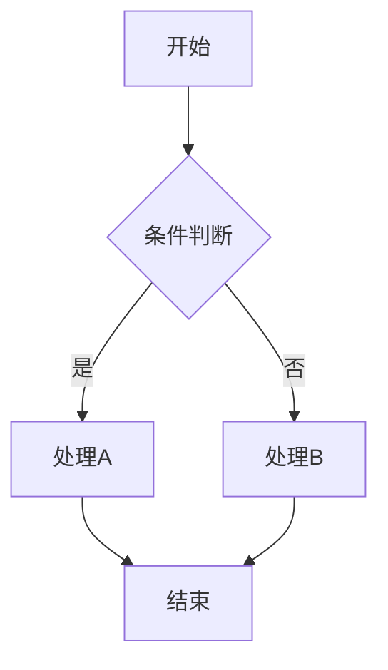

# Stream2Graph: 从倾听者到可视化者
## 降低同步话语认知负荷的主动式实时图表代理

### 完整研究流程与数据收集方案

**版本**: 1.0
**日期**: 2026年2月
**目标会议**: CSCW 2026
**研究类型**: 人机交互 (HCI) + 自然语言处理 (NLP) + 计算机支持协同工作 (CSCW)

---

## 目录

1. [研究概述与核心问题](#一研究概述与核心问题)
2. [理论基础与框架](#二理论基础与框架)
3. [技术架构设计](#三技术架构设计)
4. [数据集构建流程 (Stream2Graph)](#四数据集构建流程-stream2graph)
5. [用户实验设计](#五用户实验设计)
6. [评估指标体系](#六评估指标体系)
7. [相关研究与方法论参考](#七相关研究与方法论参考)
8. [项目时间线与里程碑](#八项目时间线与里程碑)
9. [预期贡献与创新点](#九预期贡献与创新点)

---

## 一、研究概述与核心问题

### 1.1 研究背景

在同步话语场景（如实时会议、在线研讨）中，参与者需要同时处理以下认知任务：
- 理解语音流中的信息
- 在脑海中构建概念结构
- 跟踪讨论的进展和转折
- 形成对复杂系统的整体认知

人类的工作记忆有限（Miller's Law: 7±2 chunks），在处理涉及复杂架构或流程的线性语音流时，很难构建稳健的"心理模型"。

### 1.2 现有工具的局限

| 工具类型 | 代表产品 | 主要问题 |
|---------|---------|---------|
| 静态白板 | Miro, Lucidchart | 反应式，需手动操作，打断对话流 |
| 实时字幕 | Otter, 讯飞 | 仅文本，无结构化视觉辅助 |
| AI笔记 | Notion AI, Copilot | 事后总结，非实时 |
| 可视化工具 | Tableau, PowerBI | 需数据预处理，不适合实时对话 |

### 1.3 核心研究问题

**主研究问题 (RQ1)**:
主动式实时图表代理是否能显著降低用户在同步话语中的认知负荷？

**子研究问题**:
- RQ1a: 与基线(仅听)相比，认知负荷降低多少？
- RQ1b: 与静态图表相比，实时增量更新是否提升理解效率？
- RQ1c: 主动介入 vs 反应式触发，用户偏好如何？

**主研究问题 (RQ2)**:
实时可视化是否提升了用户对复杂对话内容的理解和记忆？

### 1.4 核心概念定义

**同步话语 (Synchronous Discourse)**:
实时发生的、多参与者的话语交流，如会议、研讨、头脑风暴等。

**主动式代理 (Proactive Agent)**:
无需显式指令，能自主感知环境、判断介入时机并采取行动的AI系统。

**视觉轮次 (Visual Turn)**:
AI通过视觉更新（而非语音）参与协作对话的交互模式。

**增量稳定性 (Incremental Stability)**:
图表在更新时保持已有元素位置不变，仅调整新增元素，避免"闪烁"和认知跳跃。

---

## 二、理论基础与框架

### 2.1 理论支柱一：扩展的言语行为理论 (Visual Speech Act Theory)

**原始理论**: Austin (1962) 和 Searle (1969) 的言语行为理论
**扩展**: 将言语行为分类学扩展到视觉生成领域

#### 2.1.1 言语行为到图表类型的映射

| 言语行为类型 | 语言信号 | 对应图表类型 | 示例话语 |
|-------------|---------|-------------|---------|
| **Sequential** (序列性) | "首先...然后..." "第一步" | 流程图、时序图 | "首先用户登录，然后系统验证身份" |
| **Structural** (结构性) | "包含..." "由...组成" | 架构图、UML类图 | "系统由前端、后端和数据库组成" |
| **Classification** (分类性) | "分为...类" "类型有" | 思维导图、ER图 | "用户分为普通用户和管理员两类" |
| **Contrastive** (对比性) | "相较于..." "优缺点" | 比较矩阵、韦恩图 | "方案A比方案B有更好的性能" |

#### 2.1.2 言语行为识别特征

**Sequential行为特征**:
- 时间连接词: "首先", "然后", "接下来", "最后"
- 步骤标记: "第一步", "第二阶段"
- 因果连接: "因此", "导致", "结果是"

**Structural行为特征**:
- 组成关系: "由...构成", "包含", "分为"
- 层次描述: "顶层", "底层", "中间层"
- 模块命名: "模块A", "组件B", "子系统"

**Classification行为特征**:
- 类别词: "类型", "类别", "种类"
- 列举标记: "包括", "例如", "主要有"
- 层次词: "一级", "二级", "子类"

**Contrastive行为特征**:
- 比较词: "相较于", "比...更", "不同于"
- 评价词: "优势", "劣势", "优缺点"
- 选择词: "选择A而非B", "最好是"

### 2.2 理论支柱二：认知负荷与双重编码理论

#### 2.2.1 认知负荷理论 (Cognitive Load Theory)

**工作记忆限制**:
- 容量限制: 7±2 信息块 (Miller, 1956)
- 持续时间: 约20秒 (Baddeley, 1992)

**认知负荷类型**:
1. **内在负荷 (Intrinsic)**: 任务本身复杂度决定
2. **外在负荷 (Extraneous)**: 信息呈现方式造成
3. **关联负荷 (Germane)**: 促进学习的认知投入

**本研究目标**:
通过实时可视化降低外在认知负荷，释放工作记忆容量用于关联负荷。

#### 2.2.2 双重编码理论 (Dual Coding Theory)

**理论核心**: Paivio (1986)
人类拥有两个独立的认知子系统：
- **言语系统**: 处理语言信息
- **非言语系统**: 处理视觉-空间信息

**应用假设**:
当同一信息以言语和视觉两种形式呈现时，认知负荷降低，理解和记忆增强。

**关键条件**:
1. 视觉必须与言语语义一致
2. 视觉必须在合适的时间点出现
3. 视觉必须保持增量稳定性

### 2.3 理论支柱三：多模态轮次转换理论

#### 2.3.1 轮次转换机制

**传统对话**:
- 说话者A → 说话者B → 说话者A...
- 轮次以语音话语为单位

**多模态对话**:
- 说话者A (语音) → 系统 (视觉更新) → 说话者B (语音)
- AI通过"视觉轮次"参与协作

#### 2.3.2 视觉轮次的设计原则

1. **非侵入性**: 不中断语音对话流
2. **适时性**: 在语义切分点介入
3. **可预测性**: 用户能预期视觉更新的时机
4. **可忽略性**: 用户可选择忽略视觉而不影响对话

### 2.4 理论整合框架

```
┌─────────────────────────────────────────────────────────────┐
│                    理论整合框架                              │
├─────────────────────────────────────────────────────────────┤
│                                                             │
│   输入层: 同步话语流 (语音/文本)                              │
│      ↓                                                      │
│   ┌──────────────────────────────────────────┐             │
│   │ 扩展言语行为理论                          │             │
│   │ 识别: Sequential/Structural/              │             │
│   │       Classification/Contrastive          │             │
│   └──────────────────┬───────────────────────┘             │
│                      ↓                                      │
│   决策层: 视觉必要性分数计算                                  │
│      ↓                                                      │
│   ┌──────────────────────────────────────────┐             │
│   │ 认知负荷理论 + 双重编码理论                │             │
│   │ 目标: 降低工作记忆负荷                     │             │
│   │ 方法: 言语+视觉双重编码                    │             │
│   └──────────────────┬───────────────────────┘             │
│                      ↓                                      │
│   输出层: 实时结构化图表                                      │
│      ↓                                                      │
│   ┌──────────────────────────────────────────┐             │
│   │ 多模态轮次转换理论                        │             │
│   │ 方法: 视觉轮次参与协作                    │             │
│   │ 原则: 非侵入、适时、可预测、可忽略         │             │
│   └──────────────────────────────────────────┘             │
│                                                             │
└─────────────────────────────────────────────────────────────┘
```

---

## 三、技术架构设计

### 3.1 多智能体协作架构

借鉴Paper2SysArch的多智能体设计，构建5个协作角色：

```
┌─────────────────────────────────────────────────────────────┐
│                  多智能体协作架构                             │
├─────────────────────────────────────────────────────────────┤
│                                                             │
│   ┌──────────┐    ┌──────────┐    ┌──────────┐             │
│   │ Observer │───→│ Analyst  │───→│ Architect│             │
│   │ (监听者) │    │(意图分析)│    │ (架构师) │             │
│   └──────────┘    └────┬─────┘    └────┬─────┘             │
│                        │               │                    │
│                        ↓               ↓                    │
│                   ┌──────────┐    ┌──────────┐             │
│                   │  Critic  │    │ Renderer │             │
│                   │ (审计员) │    │ (渲染器) │             │
│                   └──────────┘    └──────────┘             │
│                                                             │
└─────────────────────────────────────────────────────────────┘
```

#### 3.1.1 Observer (监听者)

**职责**:
- 语音转文字 (ASR)
- 实时文本清洗 (去除填充词、修正ASR错误)
- 运行动态窗口算法，管理上下文

**输入**: 音频流 / 文本流
**输出**: 清洗后的文本窗口

**关键技术**:
- 流式ASR (Whisper Live等)
- 动态语义窗口 (参考Topic Shift Detection)

#### 3.1.2 Analyst (意图分析师)

**职责**: 核心决策者
- 计算"视觉必要性分数" (Visual Necessity Score)
- 判断是否需要画图
- 决定画什么类型的图
- 确定介入时机

**输入**: 文本窗口 + 历史图表状态
**输出**: 绘图决策 (类型、时机、内容)

**视觉必要性分数计算**:
```
VNS = w1 × 言语行为强度 + w2 × 信息密度 + w3 × 话题转折度
      + w4 × 时间距离(上次绘图) + w5 × 用户关注度

阈值: VNS > 0.7 时触发绘图
```

#### 3.1.3 Architect (架构师)

**职责**:
- 将需求转化为代码 (Mermaid/DOT/TikZ)
- 确保逻辑结构准确
- 避免幻觉 (Hallucination)

**输入**: 绘图决策 + 上下文
**输出**: 图表代码

**技术路线**: Text-to-Code (而非Text-to-Image)
参考DiagramAgent: Qwen2.5-Coder-7B微调

#### 3.1.4 Critic (审计员)

**职责**:
- 检查代码逻辑一致性
- 验证语法正确性
- 对比历史状态检测冲突

**输入**: 生成的代码
**输出**: 验证结果 + 修正建议

**验证方法**:
1. 编译验证: 能否渲染成图
2. 逻辑验证: 节点关系是否合理
3. 一致性验证: 与之前图表是否冲突

#### 3.1.5 Renderer (渲染器)

**职责**:
- 增量渲染图表
- 防闪烁处理 (Anchoring机制)
- 动画过渡效果

**输入**: 图表代码 + 上一状态
**输出**: 渲染后的可视化

**关键技术**:
- 增量图布局算法
- 锚点机制 (锁定旧节点位置)
- D3.js / Mermaid.js渲染

### 3.2 核心算法创新

#### 3.2.1 动态语义窗口 (Dynamic Semantic Window)

**问题**: 固定时长窗口 (如每30秒) 的局限
- 可能切割完整语义单元
- 话题转折时反应滞后

**解决方案**: 基于语义密度的自适应窗口

**算法**:
```python
def dynamic_window(utterances, threshold=0.5):
    """
    基于语义相似度的动态窗口切分
    """
    window = []
    for utterance in utterances:
        if not window:
            window.append(utterance)
            continue

        # 计算与窗口内语句的相似度
        similarity = compute_semantic_similarity(
            utterance, window[-1]
        )

        if similarity < threshold:
            # 话题转折，返回当前窗口
            yield window
            window = [utterance]
        else:
            window.append(utterance)

    if window:
        yield window
```

**参考**: Topic Shift Detection论文
- 使用MobileBERT计算句子相似度
- 6轮窗口最优 (F1=74.16%)

#### 3.2.2 Wait-k策略

**借鉴**: 同声传译中的Wait-k策略

**问题**: 实时生成时，语义不完整导致错误

**解决方案**: 保持k个语义块的延迟

```
Wait-k策略示意:

时间 →
话语: [U1] [U2] [U3] [U4] [U5] [U6]
      ↓    ↓    ↓    ↓    ↓    ↓
Wait-1:     [G1] [G2] [G3] [G4] [G5]
Wait-2:          [G1] [G2] [G3] [G4]

U: 输入话语
G: 生成图表
```

**实现**:
- k=1: 延迟1轮，快速响应
- k=2: 延迟2轮，更高准确性
- 动态调整: 根据置信度自适应

#### 3.2.3 增量图布局与锚点机制 (Anchoring)

**问题**: 图表更新时的"闪烁"问题
- 节点位置剧烈变化
- 破坏用户的"心理地图"

**解决方案**: Anchoring机制

**算法**:
```python
def incremental_layout(old_graph, new_elements):
    """
    增量图布局算法
    """
    # 1. 锁定旧节点位置
    for node in old_graph.nodes:
        node.fixed = True

    # 2. 添加新元素
    for elem in new_elements:
        old_graph.add_element(elem)

    # 3. 仅对新元素进行力导向布局
    force_directed_layout(new_elements)

    # 4. 解锁并微调
    for node in old_graph.nodes:
        node.fixed = False

    # 5. 全局优化 (保持锚点约束)
    constrained_layout(old_graph, anchor_nodes=old_nodes)
```

#### 3.2.4 长短期记忆与RAG

**问题**: 长对话中的"上下文漂移"
- 后文提到的"那个模块"指代不清

**解决方案**: 向量数据库存储历史图表实体

**架构**:
```
短期记忆: 当前窗口 (最近N轮)
长期记忆: 向量数据库 (所有历史实体)

查询流程:
1. 识别指代词 ("它", "那个模块")
2. 向量化查询
3. 从向量库检索最相关实体
4. 解析指代关系
```

---

## 四、数据集构建流程 (Stream2Graph)

### 4.1 数据集概述

**数据集名称**: Stream2Graph
**目标规模**: 5,000+ 高质量样本
**数据格式**: {对话流, 演进图表} 配对
**构建方法**: 逆向工程 (Reverse Engineering)

**创新点**:
首个面向"实时同步话语可视化"的大规模数据集

### 4.2 五阶段构建流程

#### 阶段1: 原始代码收集 (Curation)

**目标**: 6,000+ 图表代码样本

**数据来源**:

| 来源 | 数量 | 方法 | 参考 |
|-----|------|------|------|
| GitHub API | 3,000+ | 搜索.drawio, .mmd, .dot等 | DiagramAgent |
| 本地数据 | 500+ | test_dataset整合 | - |
| 合成数据 | 2,500+ | 模板生成 | Synthetic |

**GitHub搜索策略**:
```
查询: extension:drawio, extension:mmd, extension:dot
筛选: stars > 10, 最近更新 < 2年
质量: 可编译、3-30节点、无敏感信息
```

**合成数据模板**:
- 流程图模板 (20个)
- 时序图模板 (15个)
- 类图模板 (10个)
- 思维导图模板 (10个)
- 甘特图模板 (5个)

#### 阶段2: 质量筛选 (Filtering)

**筛选标准**:

| 标准 | 要求 | 淘汰率估计 |
|-----|------|-----------|
| 代码可编译性 | 语法正确，能渲染 | ~10% |
| 复杂度适中 | 3-30个节点 | ~15% |
| 无敏感信息 | 过滤个人/公司信息 | ~5% |
| 多样性保证 | 每类型≤1,500 | ~10% |

**预期结果**: 6,000 → 5,000 (保留率~83%)

**自动化筛选工具**:
```python
# 语法检查
def validate_syntax(code, format):
    if format == 'mermaid':
        return compile_mermaid(code) is not None
    elif format == 'dot':
        return compile_dot(code) is not None

# 复杂度检查
def check_complexity(code):
    node_count = count_nodes(code)
    return 3 <= node_count <= 30
```

#### 阶段3: 对话流逆向工程 (Reverse Engineering)

**核心方法**: 使用GPT-4o将图表代码转换为对话流

**Prompt设计**:
```
任务: 将图表代码逆向还原为"两人逐步设计该图表"的对话

输入: [图表代码]

要求:
1. 模拟两人协作讨论场景
2. 每3-5轮对话对应图表的一个增量更新
3. 体现真实会议中的犹豫、确认、修正
4. 标注每轮的言语行为类型

输出格式:
{
  "dialogue": [
    {
      "turn_id": 1,
      "speaker": "Speaker_A",
      "utterance": "我们来设计一下这个流程...",
      "speech_act": "sequential",
      "diagram_elements_added": ["Node_A"]
    }
  ]
}
```

**对话结构**:

| 轮次范围 | 内容类型 | 言语行为 |
|---------|---------|---------|
| 1-2轮 | 开场、需求提出 | Inform, Request |
| 3-7轮 | 主体构建 | Sequential, Structural |
| 8-10轮 | 细节完善 | Clarify, Confirm |

**质量控制**:
- 对话轮次: 5-15轮
- 言语行为多样性: ≥3种
- 图表-对话匹配度: 人工抽检

#### 阶段4: 质量验证 (Validation)

**三层验证体系**:

**Layer 1: 自动验证**
- 对话轮次合理性 (≥3轮)
- 言语行为分布多样性
- 图表与对话类型匹配

**Layer 2: 规则验证**
```python
def validate_dialogue(dialogue, diagram):
    # 检查1: 轮次合理
    if len(dialogue) < 3:
        return False, "对话太短"

    # 检查2: 行为多样
    acts = set(turn.speech_act for turn in dialogue)
    if len(acts) < 2:
        return False, "言语行为单一"

    # 检查3: 类型匹配
    if not check_type_match(dialogue, diagram.type):
        return False, "类型不匹配"

    return True, "通过"
```

**Layer 3: 人工验证 (10%抽样)**
- 对话自然度评分 (1-5分)
- 图表-对话一致性评分 (1-5分)
- 通过标准: ≥3分

#### 阶段5: 数据集整理 (Finalization)

**数据划分**:

| 划分 | 比例 | 数量 | 用途 |
|-----|------|------|------|
| 训练集 | 80% | 4,000+ | 模型训练 |
| 验证集 | 10% | 500+ | 超参数调优 |
| 测试集 | 10% | 500+ | 最终评估 |

**划分策略**:
- 按图表类型分层抽样
- 确保各集分布一致
- 固定随机种子 (seed=42)

**输出文件结构**:
```
stream2graph_dataset/
├── DATASET_CARD.md           # 数据集卡片
├── BUILD_REPORT.md           # 构建报告
├── metadata.json             # 元数据
│
├── train/
│   ├── diagram_0001.mmd      # 图表代码
│   ├── diagram_0001_dialogue.json  # 对话流
│   └── diagram_0001_meta.json      # 元数据
│
├── validation/
│   └── ...
│
└── test/
    └── ...
```

### 4.3 数据格式规范

#### 4.3.1 图表代码文件 (.mmd / .dot)



#### 4.3.2 对话流文件 (_dialogue.json)

```json
{
  "dialogue_id": "dg_0001",
  "diagram_id": "diagram_0001",
  "total_turns": 8,
  "duration_seconds": 120,
  "turns": [
    {
      "turn_id": 1,
      "speaker": "Speaker_A",
      "utterance": "我们来设计一下用户登录流程，从输入账号开始。",
      "speech_act": "sequential",
      "timestamp_offset": 0,
      "diagram_elements_added": ["Node_A"]
    },
    {
      "turn_id": 2,
      "speaker": "Speaker_B",
      "utterance": "好的，输入后需要验证身份对吧？",
      "speech_act": "confirm",
      "timestamp_offset": 15,
      "diagram_elements_added": []
    }
  ]
}
```

#### 4.3.3 元数据文件 (_meta.json)

```json
{
  "id": "diagram_0001",
  "source_type": "github",
  "diagram_type": "flowchart",
  "code_format": "mermaid",
  "node_count": 5,
  "edge_count": 4,
  "complexity_score": 0.6,
  "quality_score": 0.85,
  "speech_act_distribution": {
    "sequential": 4,
    "structural": 2,
    "confirm": 2
  }
}
```

### 4.4 数据集统计与多样性

**目标分布**:

| 图表类型 | 目标数量 | 占比 |
|---------|---------|------|
| 流程图 (Flowchart) | 1,500 | 30% |
| 时序图 (Sequence) | 1,000 | 20% |
| 架构图 (Architecture) | 800 | 16% |
| 思维导图 (Mindmap) | 600 | 12% |
| 类图 (Class) | 500 | 10% |
| 甘特图 (Gantt) | 400 | 8% |
| 其他 | 200 | 4% |

**复杂度分布**:
- Simple (3-8节点): 30%
- Medium (9-15节点): 40%
- Complex (16-25节点): 25%
- Highly Complex (26-30节点): 5%

---

## 五、用户实验设计

### 5.1 实验设计概述

**设计类型**: 被试内设计 (Within-subjects Design)
**平衡方法**: 拉丁方 (Latin Square)
**参与者**: 32人 (符合CSCW标准: 24-40人)

### 5.2 实验条件

| 条件 | 描述 | 对照目的 |
|-----|------|---------|
| **BASELINE** | 仅听对话录音，无任何可视化 | 基线认知负荷 |
| **STATIC** | 提供完整静态图表，不随对话更新 | 对比增量更新价值 |
| **REACTIVE** | 用户手动点击触发图表更新 | 对比主动性价值 |
| **PROACTIVE** | AI自动检测并实时更新图表 | **本研究方案** |

### 5.3 实验任务

**任务设计原则**:
- 每种条件下2个任务
- 任务类型平衡
- 复杂度适中 (5-10分钟完成)

**任务类型**:

| 类型 | 描述 | 测量重点 |
|-----|------|---------|
| Comprehension | 理解系统结构 | 准确性 |
| Recall | 回忆讨论内容 | 记忆保持 |
| Inference | 推理潜在问题 | 深层理解 |
| Synthesis | 综合形成见解 | 创造性 |

**示例场景**:
1. "设计一个电商系统的微服务架构"
2. "优化订单处理流程"
3. "规划新产品的功能模块"
4. "设计数据处理pipeline"

### 5.4 实验流程

**总时长**: 约60分钟/人

| 阶段 | 时长 | 内容 |
|-----|------|------|
| 1. 知情同意与问卷 | 5min | 签署同意书、人口统计学信息 |
| 2. 系统教程 | 5min | 介绍系统、练习任务 |
| 3. 正式实验 | 40min | 4条件 × 2任务 = 8任务 |
| 4. 结束问卷与访谈 | 10min | SUS量表、开放式反馈 |

**任务内流程**:
```
听对话 (3-5min) → 完成任务 (2-3min) → 填写NASA-TLX (1min)
```

### 5.5 参与者招募

**招募标准**:
- 年龄: 18-50岁
- 教育: 本科及以上
- 经验: 有团队协作/会议经验
- 能力: 视力正常，无色彩识别障碍

**样本特征平衡**:
- 性别: 男女比例接近1:1
- 专业: CS、工程、商科、设计等
- 会议经验: 覆盖不同年限

**伦理考虑**:
- 获得IRB批准
- 签署知情同意书
- 允许随时退出
- 提供适当补偿 (约100元/人)
- 数据匿名化处理

---

## 六、评估指标体系

### 6.1 客观指标

#### 6.1.1 主要指标

| 指标 | 定义 | 测量方法 | 预期效果 |
|-----|------|---------|---------|
| **Time-to-Insight (TTI)** | 回答关键逻辑问题所需时间 | 秒表计时 | PROACTIVE < STATIC |
| **Accuracy Score** | 测试问题准确率 | 百分制评分 | PROACTIVE > BASELINE |
| **Task Completion Time** | 任务完成总时间 | 秒表计时 | PROACTIVE < REACTIVE |

#### 6.1.2 次要指标

| 指标 | 定义 | 测量方法 |
|-----|------|---------|
| **Diagram Usage Count** | 图表查看/交互次数 | 日志记录 |
| **Attention Shifts** | 注意力切换次数 | 眼动追踪 |
| **Fixation Duration** | 图表区域注视时长 | 眼动追踪 |

### 6.2 主观指标

#### 6.2.1 NASA-TLX (认知负荷)

**六个维度** (1-7分 Likert量表):
1. Mental Demand (精神需求)
2. Physical Demand (体力需求)
3. Temporal Demand (时间压力)
4. Performance (绩效水平)
5. Effort (努力程度)
6. Frustration (挫败感)

**计算**: 加权平均或简单平均
**预期**: PROACTIVE条件下显著低于BASELINE

#### 6.2.2 SUS (系统可用性量表)

**10个条目** (1-5分):
- 我会频繁使用这个系统
- 系统比我预期的更简单
- ...

**评分**: 0-100分
**优秀标准**: >68分

#### 6.2.3 信任度量表

**四个维度**:
1. Reliability (可靠性)
2. Competence (能力)
3. Benevolence (善意)
4. Intention (意图)

#### 6.2.4 SART (情境感知)

**十个维度**，评估:
- 对情况的理解程度
- 信息需求的满足程度
- 注意力资源的分配

### 6.3 研究假设与统计检验

#### 6.3.1 研究假设

| 假设 | 内容 | 预期结果 |
|-----|------|---------|
| H1 | PROACTIVE的NASA-TLX显著低于BASELINE | p < 0.05, d > 0.8 |
| H2 | PROACTIVE的TTI显著短于STATIC | p < 0.05, d > 0.5 |
| H3 | PROACTIVE的用户满意度高于REACTIVE | p < 0.05 |

#### 6.3.2 统计分析方法

**描述性统计**:
- 均值、标准差、置信区间
- 各条件下指标分布

**推断性统计**:
- 重复测量方差分析 (rm-ANOVA)
- 配对t检验 (事后检验)
- Bonferroni校正

**效应量**:
- Cohen's d (小:0.2, 中:0.5, 大:0.8)
- 偏eta平方 (partial η²)

---

## 七、相关研究与方法论参考

### 7.1 核心参考文献

#### 7.1.1 DiagramAgent (CVPR)

**贡献**:
- 提出DiagramAgent多智能体框架
- 构建DiagramGenBenchmark (6,983样本)
- 验证Text-to-Code路线的优越性

**方法论借鉴**:
- 逆向工程构建数据集
- Plan-Code-Check多智能体架构
- Pass@1评估指标

**引用**:
```bibtex
@inproceedings{diagramagent2025,
  title={From Words to Structured Visuals: A Benchmark and Framework},
  booktitle={CVPR},
  year={2025}
}
```

#### 7.1.2 Paper2SysArch

**贡献**:
- 论文到系统架构图生成
- Paper2SysArch Benchmark (3,000对)
- 三层评估框架

**方法论借鉴**:
- Analyst → Architect → Designer 多智能体
- 语义/布局/视觉三层评估
- 人机协作标注

#### 7.1.3 DOC2CHART (ACL)

**贡献**:
- 意图驱动的零样本图表生成
- CHARTEVAL归因评估指标
- 长文档理解

**方法论借鉴**:
- 意图分解流程
- 数据验证与精炼
- 基于注意力的评估

#### 7.1.4 Topic Shift Detection (DePaul)

**贡献**:
- MobileBERT轻量级话题检测
- 语言学特征融合
- 6轮窗口最优

**方法论借鉴**:
- 动态语义窗口算法
- MobileBERT模型选择
- F1=74.16%的基准

#### 7.1.5 Designing Interfaces for Temporal Work (DIS '25)

**贡献**:
- 跨会议时间性工作研究
- Wizard of Oz实验方法
- 生成式AI在会议中的应用

**方法论借鉴**:
- 实验设计模式
- NASA-TLX评估
- 定性访谈方法

### 7.2 理论基础文献

| 理论 | 核心文献 | 应用 |
|-----|---------|------|
| 言语行为理论 | Austin (1962), Searle (1969) | 扩展为视觉言语行为理论 |
| 认知负荷理论 | Sweller (1988) | 解释可视化降低负荷机制 |
| 双重编码理论 | Paivio (1986) | 解释言语+视觉协同效应 |
| 工作记忆 | Baddeley (1992) | 解释实时处理限制 |
| 人机协作 | Klein (2007) | 主动式代理设计原则 |

### 7.3 技术实现参考

| 技术 | 参考 | 应用 |
|-----|------|------|
| 流式ASR | Whisper Live | 实时语音转文字 |
| 文本生成代码 | Qwen2.5-Coder | Architect智能体 |
| 图布局 | D3.js, Mermaid.js | Renderer智能体 |
| 向量数据库 | Chroma, Pinecone | 长期记忆 |
| 语义相似度 | BERT, MobileBERT | 动态窗口 |

---

## 八、项目时间线与里程碑

### 8.1 总体时间线

**总时长**: 20-28周 (约5-7个月)

| 阶段 | 任务 | 时长 | 里程碑 |
|-----|------|------|--------|
| **Phase 1** | 数据收集 | 4-6周 | Stream2Graph数据集完成 |
| **Phase 2** | 系统开发 | 6-8周 | 原型系统可用 |
| **Phase 3** | 实验准备 | 2-3周 | IRB批准、招募完成 |
| **Phase 4** | 用户实验 | 3-4周 | 32人数据收集完成 |
| **Phase 5** | 数据分析 | 2-3周 | 统计报告完成 |
| **Phase 6** | 论文撰写 | 4-6周 | CSCW投稿就绪 |

### 8.2 详细里程碑

**Week 1-2: 准备阶段**
- [ ] 完成详细设计文档
- [ ] 搭建开发环境
- [ ] 申请IRB

**Week 3-6: 数据收集**
- [ ] GitHub数据下载完成
- [ ] 合成数据生成完成
- [ ] 质量筛选完成
- [ ] 对话逆向工程完成

**Week 7-14: 系统开发**
- [ ] Observer模块完成
- [ ] Analyst模块完成
- [ ] Architect模块完成
- [ ] Critic模块完成
- [ ] Renderer模块完成
- [ ] 系统集成测试

**Week 15-17: 实验准备**
- [ ] IRB批准获得
- [ ] 招募32名参与者
- [ ] 实验材料准备
- [ ] 预实验测试

**Week 18-21: 用户实验**
- [ ] 32人实验完成
- [ ] 数据清理
- [ ] 初步分析

**Week 22-24: 数据分析**
- [ ] 统计分析完成
- [ ] 可视化图表生成
- [ ] 结果解读

**Week 25-30: 论文撰写**
- [ ] 初稿完成
- [ ] 导师反馈
- [ ] 修改完善
- [ ] CSCW投稿

### 8.3 风险与应对

| 风险 | 可能性 | 影响 | 应对措施 |
|-----|-------|------|---------|
| 数据收集不足 | 中 | 高 | 增加合成数据比例 |
| 系统开发延迟 | 中 | 高 | 优先核心功能 |
| 招募困难 | 低 | 中 | 提高补偿、扩展渠道 |
| 实验效果不显著 | 中 | 高 | 预实验调优 |

---

## 九、预期贡献与创新点

### 9.1 理论贡献

1. **视觉言语行为理论**
   扩展经典言语行为理论到视觉生成领域，建立形式化的语言-图表映射分类学。

2. **主动式可视化理论框架**
   提出AI作为"静默协作者"的理论框架，定义视觉轮次的概念和设计原则。

3. **实时可视化认知机制**
   揭示实时可视化降低认知负荷的心理机制，验证双重编码理论在同步话语中的应用。

### 9.2 技术创新

1. **多智能体协作架构**
   Observer-Analyst-Architect-Critic-Renderer五智能体协作系统。

2. **动态语义窗口算法**
   基于语义密度的自适应窗口切分，优于固定时长窗口。

3. **增量稳定渲染机制**
   Anchoring机制解决图表更新"闪烁"问题。

4. **视觉必要性评分模型**
   多维度评估何时需要生成图表。

### 9.3 数据集贡献

**Stream2Graph数据集**:
- 首个面向实时同步话语可视化的大规模数据集
- 5,000+ {对话流, 演进图表} 配对
- 支持训练意图识别和图表生成模型

### 9.4 应用价值

1. **会议效率提升**
   降低远程会议的认知负荷，提高信息 retention。

2. **教育辅助**
   实时可视化课堂讨论，帮助学生理解复杂概念。

3. **知识管理**
   自动生成会议知识图谱，支持时间性工作。

### 9.5 论文发表计划

**主要投稿**: CSCW 2026
**备选投稿**: CHI 2027, UIST 2027

**论文类型**: Full Paper (10页)

---

## 附录

### 附录A: 术语表

| 术语 | 英文 | 定义 |
|-----|------|------|
| 同步话语 | Synchronous Discourse | 实时发生的多参与者话语交流 |
| 主动式代理 | Proactive Agent | 自主感知并行动的AI系统 |
| 视觉轮次 | Visual Turn | AI通过视觉更新参与协作 |
| 增量稳定性 | Incremental Stability | 图表更新时保持已有元素位置 |
| 言语行为 | Speech Act | 语言的使用方式及其功能 |
| 认知负荷 | Cognitive Load | 工作记忆的负担 |
| 逆向工程 | Reverse Engineering | 从结果反推过程的方法 |

### 附录B: 代码仓库结构

```
stream2graph/
├── data/                       # 数据集
│   ├── raw/
│   ├── processed/
│   └── final/
├── src/                        # 源代码
│   ├── agents/                 # 多智能体
│   ├── algorithms/             # 核心算法
│   └── utils/                  # 工具函数
├── experiments/                # 实验
│   ├── design/
│   ├── data/
│   └── analysis/
├── evaluation/                 # 评估
│   ├── metrics/
│   └── benchmarks/
└── docs/                       # 文档
```

### 附录C: 联系信息

**项目负责人**: [姓名]
**邮箱**: [邮箱]
**机构**: [机构名称]
**项目主页**: [URL]

---

*本报告为Stream2Graph研究项目的完整流程文档，旨在指导CSCW 2026论文的投稿准备工作。*
