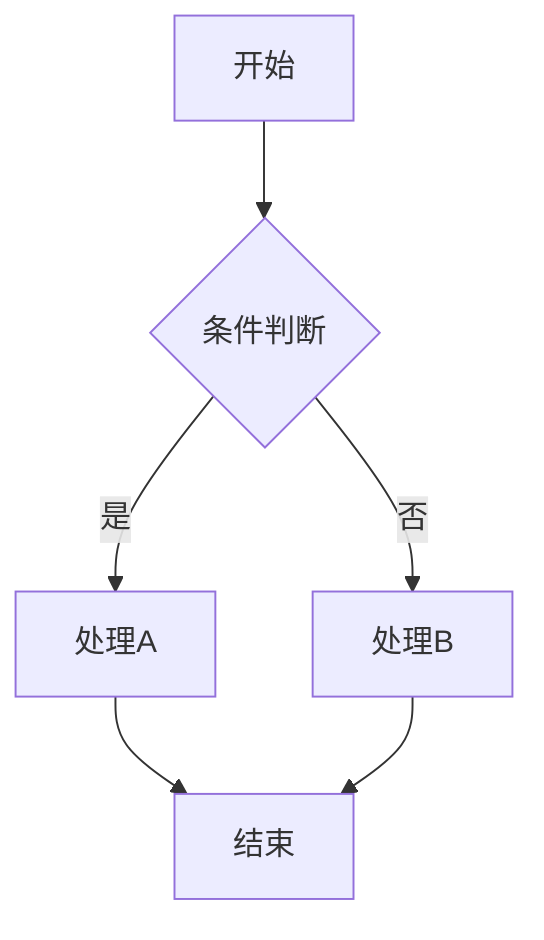

# Stream2Graph 数据集构建流程

## 基于《实时成图研究想法》原始报告的完整实现方案

**版本**: 2.0 (基于原始报告修正)
**日期**: 2026年2月
**目标会议**: CSCW 2026

---

## 重要说明

本文档严格遵循《实时成图：面向同步话语流的实时自适应多模态可视化代理研究：可行性分析与创新路径报告》中的理论框架和技术实现原理，参照《从文字到结构化视觉》(DiagramAgent) 论文的数据集构建方法论进行具体实现。

---

## 一、理论基础 (完全保留原始报告)

### 1.1 视觉言语行为理论 (Visual Speech Act Theory)

将经典言语行为理论扩展到视觉域，建立"视觉言语行为映射分类学"：

| 行为类型 | 语言特征/关键词 | 映射图表类型 |
|---------|----------------|-------------|
| **序列性行为 (Sequential Acts)** | 时间或因果连词："首先...然后..."、"导致..."、"引起..." | 流程图 (Flowchart)、时序图 (Sequence Diagram) |
| **结构性行为 (Structural Acts)** | 系统组件描述："包含"、"由...组成"、"模块"、"层级" | 架构图 (Architecture Diagram)、UML类图 |
| **分类性行为 (Classification Acts)** | 层级或归类："分为...几类"、"类型"、"属于" | 思维导图 (Mind Map)、树状图 (Tree Diagram) |
| **对比性行为 (Contrastive Acts)** | 比较或权衡："相较于"、"区别在于"、"优缺点"、"方案A vs 方案B" | 比较矩阵 (Comparison Matrix)、表格 (Table) |
| **关系/实体行为** | 数据模型描述："拥有"、"属性"、"一对多"、"外键" | ER图 (Entity-Relationship Diagram) |

**双重编码理论假设**: 只有当视觉生成与语义切分点同步且视觉形式稳定时，才能降低认知负荷，否则会产生"注意分裂效应"。

### 1.2 核心科学问题 (原始报告)

1. **流式上下文的动态切分**: 如何确定生成一张图表所需的"最佳上下文窗口"？（窗口过短丢失逻辑，过长引入噪声）
2. **多模态视觉意图检测**: 如何从纯语言线索中判断何时介入是恰当且非干扰性的？
3. **增量视觉稳定性**: 如何解决图表演进过程中的"闪烁（Flicker）"问题，维护用户的心理地图？

---

## 二、技术架构 (完全保留原始报告的五智能体分工)

### 2.1 多智能体协作架构

```
┌─────────────────────────────────────────────────────────────┐
│                    多智能体协作架构                           │
├─────────────────────────────────────────────────────────────┤
│                                                             │
│  ┌─────────────┐                                            │
│  │  Observer   │  监听者                                    │
│  │  (监听者)   │  - 语音转文字(ASR)                          │
│  │             │  - 文本清洗                                 │
│  │             │  - 动态滑动窗口算法                          │
│  └──────┬──────┘                                            │
│         ↓                                                   │
│  ┌─────────────┐                                            │
│  │   Analyst   │  意图分析师 (核心决策者)                     │
│  │  (意图分析) │  - 计算"视觉必要性分数"                      │
│  │             │  - 决定"画什么"(图表类型)                     │
│  │             │  - 基于视觉言语行为理论决策                    │
│  └──────┬──────┘                                            │
│         ↓                                                   │
│  ┌─────────────┐    ┌─────────────┐                         │
│  │  Architect  │ ←→ │   Critic    │                         │
│  │   (架构师)  │    │   (审计员)  │                         │
│  │             │    │             │                         │
│  │ 生成Mermaid │    │ 检查语法和  │                         │
│  │ 或DOT代码   │    │ 逻辑错误    │                         │
│  └──────┬──────┘    └─────────────┘                         │
│         ↓                                                   │
│  ┌─────────────┐                                            │
│  │  Renderer   │  渲染器                                     │
│  │   (渲染器)  │  - 转化为SVG/Canvas                         │
│  │             │  - 增量布局                                  │
│  │             │  - 防闪烁处理                                │
│  └─────────────┘                                            │
│                                                             │
└─────────────────────────────────────────────────────────────┘
```

### 2.2 各智能体详细职责 (原始报告)

**1. 监听者 (The Observer)**
- 负责语音转文字（ASR）
- 执行文本清洗
- 运行动态滑动窗口算法，实时维护对话流

**2. 意图分析师 (The Analyst) —— 核心决策者**
- 分析当前窗口文本，计算"视觉必要性分数 (Visual Necessity Score)"
  - 例如：闲聊得0.1分，架构描述得0.9分
- 根据视觉言语行为理论决定"画什么"（图表类型）

**3. 架构师 (The Architect)**
- 将分析师的需求转化为图表代码（Intermediate Representation）
- 使用 Mermaid.js 或 Graphviz DOT
- **关键点**: 使用代码而非像素生成，以精确控制逻辑结构并避免幻觉

**4. 审计员 (The Critic)**
- 在渲染前检查代码的语法错误和逻辑漏洞
- 确保图表可编译且无明显错误

**5. 渲染器 (The Renderer)**
- 将代码转化为 SVG/Canvas
- 负责增量布局和防闪烁处理

---

## 三、核心算法 (完全保留原始报告)

### 3.1 动态语义窗口 (Dynamic Semantic Window)

**问题**: 传统固定窗口（如每30秒）容易切断逻辑或包含噪声。

**方案**: 基于语义密度和话题漂移检测
- 实时计算当前句子与前序窗口中心主题向量的余弦相似度 (Cosine Similarity)
- 若相似度骤降且幅度超过阈值 θ，判定为话题转换 (Topic Shift)
- 此时"关闭"当前窗口触发绘图，并开启新窗口，从而实现自适应切分

### 3.2 Wait-k 策略 (Wait-k Policy)

**借鉴**: 同声传译策略

**机制**: 系统不应在每个词后立即反应，而是保持 k 个语义块 (Semantic Units) 的延迟

**目的**: 等待语义完整（如等待动词出现，或"但是"转折结束）后再生成视觉节点，避免生成错误的中间状态

### 3.3 增量图布局与锚点机制 (Incremental Layout & Anchoring)

**问题**: 图表更新时的全局重排会导致视觉突变（Flicker），破坏用户的心理地图。

**方案**:
- **锚点机制**: 更新图表时，锁定旧节点（如A、B）的坐标位置
- **局部力导向**: 仅对新节点（如C）进行力导向布局计算
- **平滑过渡**: 使用动画插值，让新节点从源节点"生长"出来

### 3.4 长短期记忆与 RAG

- 利用向量数据库存储历史图表实体
- 当对话中出现"那个模块"时，通过 RAG（检索增强生成）找回前文定义的具体名称（如"Payment Gateway"）
- 解决上下文漂移问题

---

## 四、数据集构建：Stream2Graph (参照DiagramAgent方法论实现)

### 4.1 构建策略

由于缺乏现成的"对话-演进图表"配对数据，采用**"逆向工程（Reverse Engineering）"**方法构建 Stream2Graph 数据集。

**参照DiagramAgent的核心思想**:
- 收集现有高质量图表代码
- 利用大模型反推生成对话指令
- 通过编译验证确保代码质量

### 4.2 五阶段构建流程

#### 阶段1: 数据搜集 (Data Curation)

**目标**: 收集 5,000+ 高质量的 Mermaid/PlantUML/DOT 源码

**数据来源** (参照DiagramAgent):

| 来源 | 目标数量 | 方法 | 格式 |
|-----|---------|------|------|
| GitHub | 2,000+ | API搜索 | .mmd, .mermaid, .dot, .puml |
| HuggingFace数据集 | 1,000+ | 下载现有数据集 | VGQA, datikz等 |
| 本地数据 | 500+ | test_dataset整合 | 已有图表文件 |
| 合成数据 | 1,500+ | 模板生成 | 覆盖所有图表类型 |

**GitHub搜索策略** (参照DiagramAgent):
```
查询: extension:mmd, extension:mermaid, extension:dot, extension:puml
筛选: 优先选择stars > 10的仓库
格式: Mermaid, PlantUML, Graphviz DOT
```

**图表类型分布** (参照原始报告的视觉言语行为分类):

| 图表类型 | 目标数量 | 占比 | 对应言语行为 |
|---------|---------|------|-------------|
| 流程图 (Flowchart) | 1,200 | 24% | Sequential |
| 时序图 (Sequence) | 800 | 16% | Sequential |
| 架构图 (Architecture) | 800 | 16% | Structural |
| UML类图 (Class) | 600 | 12% | Structural |
| 思维导图 (Mindmap) | 600 | 12% | Classification |
| ER图 | 400 | 8% | 关系/实体行为 |
| 比较矩阵 (Matrix) | 300 | 6% | Contrastive |
| 其他 | 300 | 6% | - |
| **总计** | **5,000** | **100%** | - |

#### 阶段2: 数据清洗与过滤 (参照DiagramAgent)

**核心标准**: "能否成功编译成图像"是唯一的硬性标准

**过滤流程**:

1. **编译验证**:
   - Mermaid代码: 使用Mermaid CLI编译
   - DOT代码: 使用Graphviz编译
   - PlantUML: 使用PlantUML编译器

2. **过滤条件**:
   - 必须能成功编译成图像
   - 节点数: 3-30个 (适中复杂度)
   - 无敏感信息 (个人/公司信息)

3. **预期结果**:
   - 原始收集: 6,000+
   - 过滤后保留: 5,000+ (保留率~83%)

**代码示例**:
```python
def validate_mermaid(code: str) -> bool:
    """验证Mermaid代码能否编译"""
    try:
        result = subprocess.run(
            ['mmdc', '-i', '-', '-o', '-'],
            input=code,
            capture_output=True,
            text=True,
            timeout=10
        )
        return result.returncode == 0
    except:
        return False

def validate_dot(code: str) -> bool:
    """验证DOT代码能否编译"""
    try:
        result = subprocess.run(
            ['dot', '-Tpng', '-o', '/dev/null'],
            input=code,
            capture_output=True,
            text=True,
            timeout=10
        )
        return result.returncode == 0
    except:
        return False
```

#### 阶段3: 逆向工程生成对话 (核心创新)

**方法**: 利用 GPT-4-Vision 或 Claude 3.5 生成自然会议对话

**Prompt策略** (参照原始报告):
```
任务: 生成一段自然的会议对话

输入: [图表代码]

要求:
"请生成一段自然的会议对话，对话中两名工程师正在逐步设计并描述这张图表的内容。"

对话要求:
1. 体现两人协作讨论场景 (Speaker_A 和 Speaker_B)
2. 对话应逐步构建图表，每3-5轮对应一个增量更新
3. 体现真实会议中的犹豫、确认、修正
4. 根据图表类型体现对应的言语行为:
   - 流程图: 使用"首先...然后..."等序列性词汇
   - 架构图: 使用"包含..."、"模块"等结构性词汇
   - 思维导图: 使用"分为...类"等分类性词汇
   - 比较矩阵: 使用"相较于..."等对比性词汇

输出格式:
{
  "dialogue_id": "dg_xxx",
  "diagram_id": "dia_xxx",
  "turns": [
    {
      "turn_id": 1,
      "speaker": "Speaker_A",
      "utterance": "...",
      "speech_act": "sequential|structural|classification|contrastive",
      "timestamp_offset": 0,
      "diagram_elements_added": ["Node_A"]
    }
  ],
  "incremental_steps": [
    {
      "step_id": 1,
      "trigger_turn": 3,
      "code_delta": "添加A→B的连接",
      "code_state": "当前完整代码"
    }
  ]
}
```

**对话结构要求**:
- 总轮次: 8-15轮
- 每轮时长: 约10-20秒
- 言语行为: 至少体现2种以上类型
- 增量步骤: 3-5个步骤完成整个图表

#### 阶段4: 质量验证 (参照DiagramAgent的Check Agent)

**三层验证体系**:

**Layer 1: 自动验证**
- 对话轮次合理性 (≥8轮)
- 言语行为分布多样性 (≥2种)
- 图表与对话类型匹配 (关键词检查)

**Layer 2: 编译验证** (参照DiagramAgent)
- 每个增量步骤的代码必须可编译
- 使用Check Agent机制:
  - 调试 (Debugging): 调用编译器检查语法错误
  - 验证 (Verification): 检查对话与代码的一致性

**Layer 3: 人工抽样验证** (10%样本)
- 对话自然度评分 (1-5分)，要求≥3分
- 图表-对话一致性评分 (1-5分)，要求≥3分
- 言语行为标注准确性

**质量指标目标** (参照DiagramAgent):
- Pass@1 (编译通过率): >90%
- 对话自然度: ≥85%样本≥3分
- 一致性评分: ≥80%样本≥3分

#### 阶段5: 数据集整理与划分

**数据划分** (参照DiagramAgent):

| 划分 | 比例 | 数量 | 用途 |
|-----|------|------|------|
| 训练集 | 80% | 4,000+ | 模型训练 |
| 验证集 | 10% | 500+ | 超参数调优 |
| 测试集 | 10% | 500+ | 最终评估 |

**划分策略**:
- 按图表类型分层抽样
- 确保各集分布一致
- 固定随机种子 (seed=42)

**输出文件结构**:
```
stream2graph_dataset/
├── DATASET_CARD.md              # 数据集卡片
├── BUILD_REPORT.md              # 构建报告
├── statistics.json              # 统计信息
│
├── train/
│   ├── diagram_0001.mmd         # 最终图表代码
│   ├── diagram_0001_dialogue.json   # 完整对话
│   ├── diagram_0001_meta.json       # 元数据
│   └── diagram_0001_steps/      # 增量步骤
│       ├── step_01.mmd
│       ├── step_01.json         # 对应对话轮次
│       └── ...
│
├── validation/
│   └── ...
│
└── test/
    └── ...
```

### 4.3 数据格式规范

#### 4.3.1 图表代码文件 (.mmd / .dot / .puml)



#### 4.3.2 对话文件 (_dialogue.json)

```json
{
  "dialogue_id": "dg_0001",
  "diagram_id": "dia_0001",
  "total_turns": 10,
  "duration_seconds": 150,
  "participants": ["Speaker_A", "Speaker_B"],
  "turns": [
    {
      "turn_id": 1,
      "speaker": "Speaker_A",
      "utterance": "我们来设计一下用户登录流程，从输入账号开始。",
      "speech_act": "sequential",
      "timestamp_offset": 0,
      "incremental_step": 1
    },
    {
      "turn_id": 2,
      "speaker": "Speaker_B",
      "utterance": "好的，输入后需要验证身份对吧？",
      "speech_act": "confirm",
      "timestamp_offset": 12,
      "incremental_step": null
    },
    {
      "turn_id": 3,
      "speaker": "Speaker_A",
      "utterance": "对，验证通过就进入主页，失败就提示错误。",
      "speech_act": "sequential",
      "timestamp_offset": 28,
      "incremental_step": 2
    }
  ],
  "incremental_steps": [
    {
      "step_id": 1,
      "trigger_turn": 1,
      "description": "添加开始节点",
      "code_added": "A[开始]",
      "code_state": "flowchart TD\n    A[开始]"
    },
    {
      "step_id": 2,
      "trigger_turn": 3,
      "description": "添加判断和分支",
      "code_added": "B{验证} -->|通过| C[主页]\n    B -->|失败| D[错误提示]",
      "code_state": "flowchart TD\n    A[开始] --> B{验证}\n    B -->|通过| C[主页]\n    B -->|失败| D[错误提示]"
    }
  ]
}
```

#### 4.3.3 元数据文件 (_meta.json)

```json
{
  "id": "dia_0001",
  "source_type": "github|synthetic|huggingface",
  "diagram_type": "flowchart",
  "code_format": "mermaid",
  "speech_act_type": "sequential",
  "node_count": 5,
  "edge_count": 4,
  "complexity": "medium",
  "dialogue_turns": 10,
  "incremental_steps": 4,
  "compilation_passed": true,
  "quality_score": 0.92
}
```

---

## 五、评估指标 (完全保留原始报告)

### 5.1 客观指标 (System Performance)

| 指标 | 定义 | 目标值 | 测量方法 |
|-----|------|--------|---------|
| **图编辑距离 (GED)** | 生成图与Ground Truth的结构差异 | 越低越好 | 节点/边增删改数量 |
| **意图准确率 (Intent Accuracy)** | 判断"是否需要画图"及"图表类型"的F1-Score | >85% | 分类准确率 |
| **闪烁指数 (Flicker Index)** | 连续两帧间相同节点的位移距离 | <阈值 | 像素位移 |
| **延迟 (Latency)** | 从话语结束到图表更新的时间 | <2秒 | 秒表计时 |

### 5.2 主观与认知指标 (Cognitive Evaluation)

| 指标 | 说明 | 测量工具 |
|-----|------|---------|
| **NASA-TLX** | 心理需求、挫败感等认知负荷 | 6维度量表 |
| **洞察时间 (TTI)** | 回答复杂逻辑问题的反应速度 | 秒表计时 |
| **眼动追踪** | 分析"视觉卸载"行为 | 眼动仪 |

### 5.3 实验设计 (Wizard of Oz)

对比"仅听录音"与"实时图表辅助"两组用户的表现。

**实验条件**:
1. BASELINE: 仅听对话录音
2. PROACTIVE: 实时图表辅助

---

## 六、实现代码

### 6.1 主数据收集流程

见 `data_collection_pipeline_v2.py`

### 6.2 逆向工程对话生成

见 `dialogue_reverse_engineering_v2.py`

### 6.3 质量验证工具

见 `quality_validator_v2.py`

---

## 七、与DiagramAgent的对比

| 方面 | DiagramAgent | Stream2Graph (本研究) |
|-----|-------------|---------------------|
| **核心任务** | Text-to-Diagram | Dialogue-to-Diagram (实时) |
| **输入** | 静态文本指令 | 流式对话 |
| **输出** | 静态图表 | 增量演进图表 |
| **数据集** | {指令, 代码} 配对 | {对话流, 演进图表} 配对 |
| **多智能体** | Plan-Code-Check | Observer-Analyst-Architect-Critic-Renderer |
| **核心创新** | Text-to-Code路线 | 实时流式处理 + 视觉言语行为理论 |
| **评估重点** | 代码准确性 | 认知负荷降低 + 实时性 |

---

## 八、项目时间线

| 阶段 | 任务 | 时长 | 里程碑 |
|-----|------|------|--------|
| Phase 1 | 数据收集 (5,000+样本) | 4-6周 | Stream2Graph数据集完成 |
| Phase 2 | 系统开发 | 6-8周 | 原型系统可用 |
| Phase 3 | 用户实验 | 3-4周 | 32人数据收集 |
| Phase 4 | 论文撰写 | 4-6周 | CSCW投稿就绪 |
| **总计** | | **17-24周** | |

---

## 九、引用

### 原始报告
```bibtex
@techreport{realtime_diagram_2026,
  title={实时成图：面向同步话语流的实时自适应多模态可视化代理研究：可行性分析与创新路径报告},
  year={2026}
}
```

### DiagramAgent参考
```bibtex
@inproceedings{diagramagent2025,
  title={From Words to Structured Visuals: A Benchmark and Framework for Text-to-Diagram Generation and Editing},
  booktitle={CVPR},
  year={2025}
}
```

---

*本文档严格基于《实时成图研究想法》原始报告，参照DiagramAgent方法论进行数据集构建的具体实现。*
